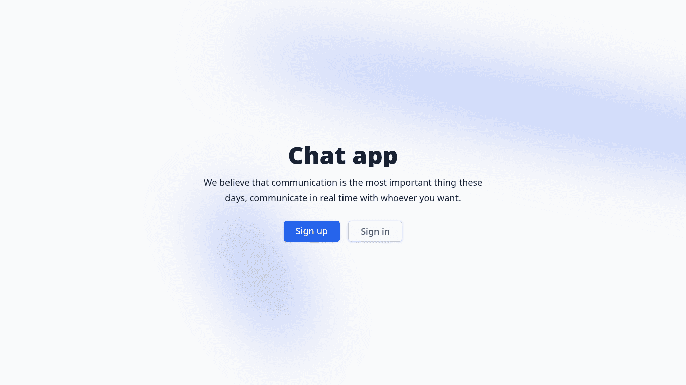
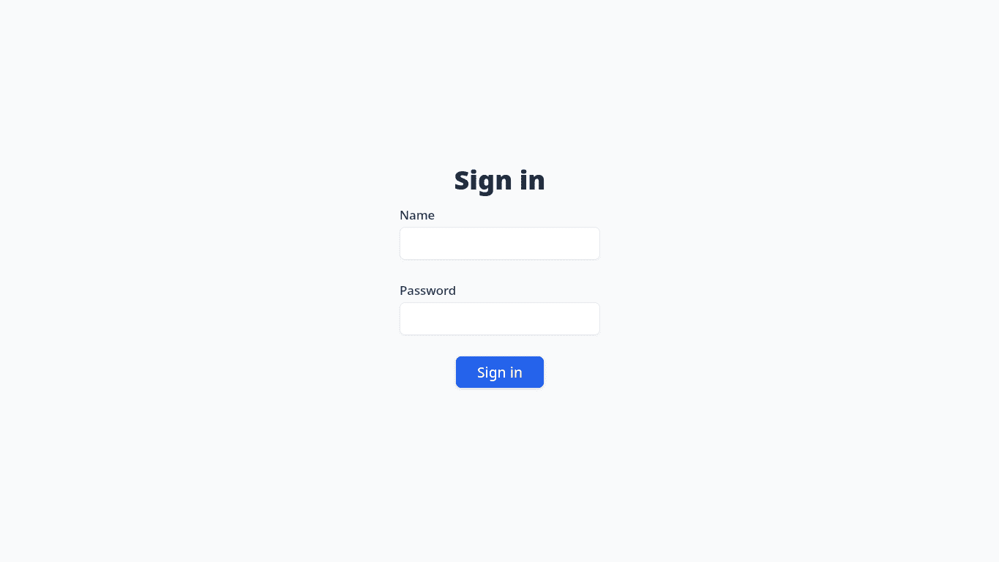
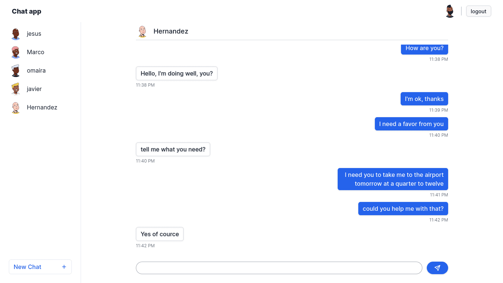

# Chat app project
In this project I wanted to implement a basic chat application with authentication, rest API for communication and websockets for real-time data transfer.

## Set up
I separate the project in client and server

Set up the server
```bash
cd server
# install dependencies
pnpm install
# build
pnpm build
# run
pnpm start
```

Set up the client
```bash
cd client
# install dependencies
pnpm install
# build
pnpm build
# run
pnpm start
```
Basically the same

## Technologies
Server
 - Sqlite
 - express
 - JWT
 - zod
 - socket.io
 - drizzle
 - Typescript

Client
 - Vite
 - Solidjs
 - Tailwindcss
 - socket.io

## REST API structure
 - /api/auth/signup
 - /api/auth/signin
 - /api/chats | creates and read chats
 - /api/messages/:chatId | creates and read messages

## Screenshots



